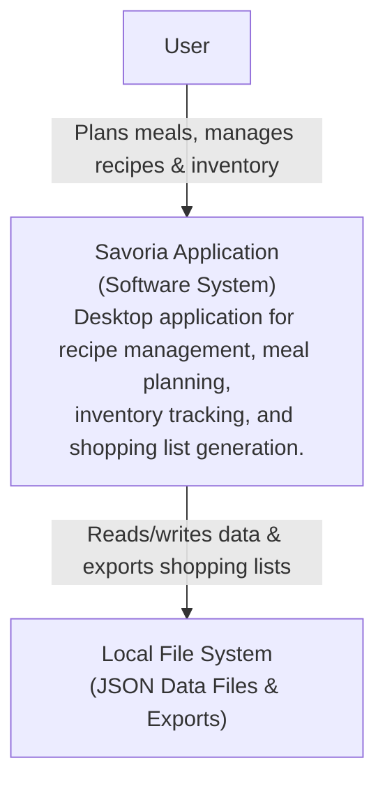
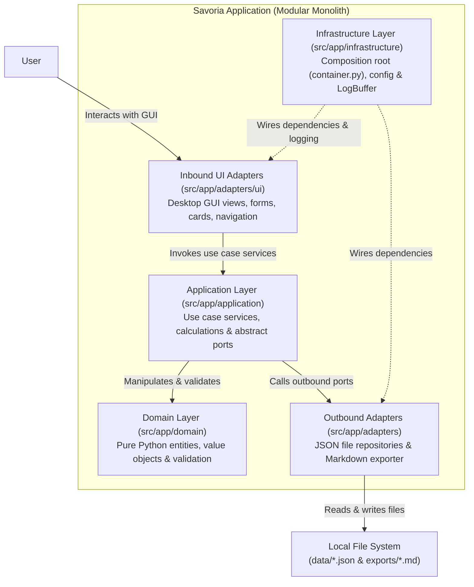
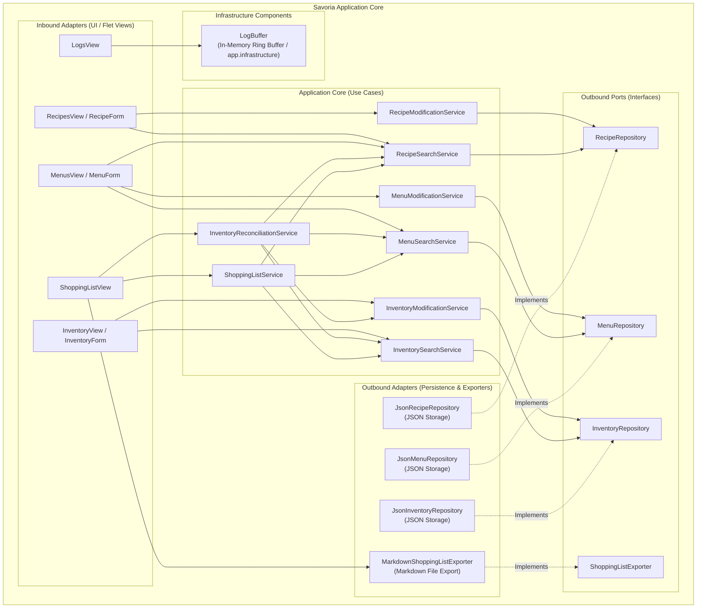
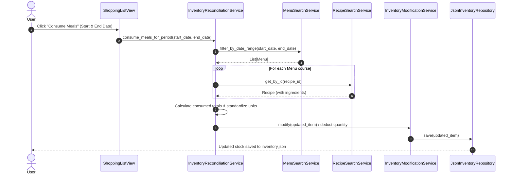

# C4 Architecture Snapshot

## Level 1: Context

```mermaid
flowchart TD
    %% Actors
    User["User"]

    %% System
    System["Savoria Application<br/>(Software System)<br/>Desktop application for recipe management, meal planning,<br/>inventory tracking, and shopping list generation."]

    %% External Systems
    FileSystem["Local File System<br/>(JSON Data Files & Exports)"]

    %% Relationships
    User -->|Plans meals, manages recipes & inventory| System
    System -->|Reads/writes data & exports shopping lists| FileSystem
```

## Level 2: Containers

```mermaid
flowchart TD
    %% Actor
    User["User"]

    %% External System
    FileSystem["Local File System<br/>(data/*.json & exports/*.md)"]

    subgraph SavoriaApp ["Savoria Application (Modular Monolith)"]

        InboundUI["Inbound UI Adapters (src/app/adapters/ui)<br/>Desktop GUI views, forms, cards, navigation"]

        AppLayer["Application Layer (src/app/application)<br/>Use case services, calculations & abstract ports"]

        DomainLayer["Domain Layer (src/app/domain)<br/>Pure Python entities, value objects & validation"]

        OutboundAdapters["Outbound Adapters (src/app/adapters)<br/>JSON file repositories & Markdown exporter"]

        InfraLayer["Infrastructure Layer (src/app/infrastructure)<br/>Composition root (container.py), config & LogBuffer"]

    end

    %% Flow Relationships
    User -->|Interacts with GUI| InboundUI
    InboundUI -->|Invokes use case services| AppLayer
    AppLayer -->|Manipulates & validates| DomainLayer
    AppLayer -->|Calls outbound ports| OutboundAdapters
    OutboundAdapters -->|Reads & writes files| FileSystem

    InfraLayer -.->|Wires dependencies & logging| InboundUI
    InfraLayer -.->|Wires dependencies| OutboundAdapters
```

## Level 3: Components

```mermaid
flowchart TD
    subgraph SavoriaMonolith ["Savoria Application Core"]

        subgraph InboundAdapters ["Inbound Adapters (UI / Flet Views)"]
            RV["RecipesView / RecipeForm"]
            MV["MenusView / MenuForm"]
            IV["InventoryView / InventoryForm"]
            SLV["ShoppingListView"]
            LV["LogsView"]
        end

        subgraph CoreServices ["Application Core (Use Cases)"]
            RMS["RecipeModificationService"]
            RSS["RecipeSearchService"]
            MMS["MenuModificationService"]
            MSS["MenuSearchService"]
            IMS["InventoryModificationService"]
            ISS["InventorySearchService"]
            IRS["InventoryReconciliationService"]
            SLS["ShoppingListService"]
        end

        subgraph OutboundPorts ["Outbound Ports (Interfaces)"]
            RP["RecipeRepository"]
            MP["MenuRepository"]
            IP["InventoryRepository"]
            SLEP["ShoppingListExporter"]
        end

        subgraph OutboundAdapters ["Outbound Adapters (Persistence & Exporters)"]
            JRR["JsonRecipeRepository\n(JSON Storage)"]
            JMR["JsonMenuRepository\n(JSON Storage)"]
            JIR["JsonInventoryRepository\n(JSON Storage)"]
            MSLE["MarkdownShoppingListExporter\n(Markdown File Export)"]
        end

        subgraph Infrastructure ["Infrastructure Components"]
            LB["LogBuffer\n(In-Memory Ring Buffer / app.infrastructure)"]
        end

        %% UI to Application Connections
        RV --> RMS
        RV --> RSS
        MV --> MMS
        MV --> MSS
        MV --> RSS
        IV --> IMS
        IV --> ISS
        SLV --> SLS
        SLV --> IRS
        SLV --> MSLE
        LV --> LB

        %% Service to Ports Connections
        RMS --> RP
        RSS --> RP
        MMS --> MP
        MSS --> MP
        IMS --> IP
        ISS --> IP
        IRS --> ISS
        IRS --> IMS
        IRS --> MSS
        IRS --> RSS
        SLS --> RSS
        SLS --> MSS
        SLS --> ISS

        %% Port Implementations
        JRR -.->|Implements| RP
        JMR -.->|Implements| MP
        JIR -.->|Implements| IP
        MSLE -.->|Implements| SLEP
    end
```

## Level 4: Code Flow (Sequence Diagram)

```mermaid
sequenceDiagram
    autonumber
    actor User as User
    participant View as ShoppingListView
    participant Recon as InventoryReconciliationService
    participant MenuSvc as MenuSearchService
    participant RecipeSvc as RecipeSearchService
    participant InvMod as InventoryModificationService
    participant Repo as JsonInventoryRepository

    User->>View: Click "Consume Meals" (Start & End Date)
    View->>Recon: consume_meals_for_period(start_date, end_date)
    Recon->>MenuSvc: filter_by_date_range(start_date, end_date)
    MenuSvc-->>Recon: List[Menu]
    
    loop For each Menu course
        Recon->>RecipeSvc: get_by_id(recipe_id)
        RecipeSvc-->>Recon: Recipe (with ingredients)
    end
    
    Recon->>Recon: Calculate consumed totals & standardize units
    Recon->>InvMod: modify(updated_item) / deduct quantity
    InvMod->>Repo: save(updated_item)
    Repo-->>User: Updated stock saved to inventory.json
```
